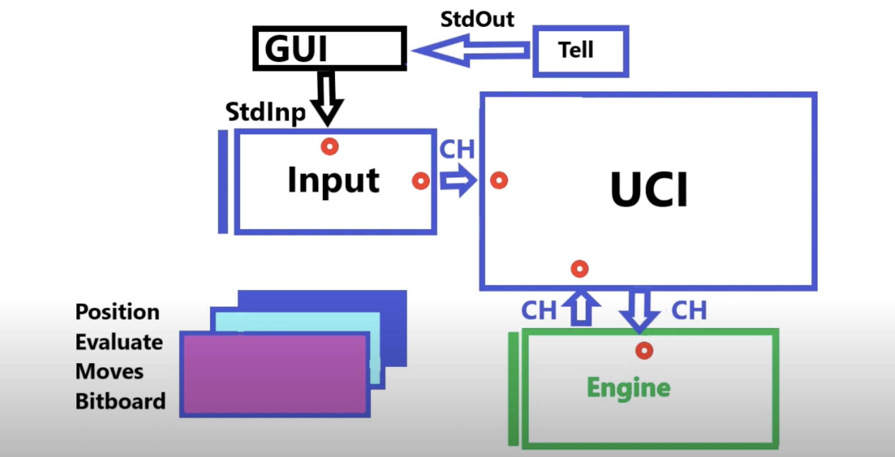

# ch3ckm8

## Description
A chess engine which implements:

Bitboards for board representation.
Alpha-beta pruning for move searching.
Piece-Square tables for board evaluation.
Fen String support to load arbitrary games and play them.
A slice of the Universal Chess Interface (UCI) to allow challenges via lichess.org
A command-line user interface

## Usage
```bash
ch3ckm8 start new --depth 10
ch3ckm8 start new --growth
```
## Architecture
